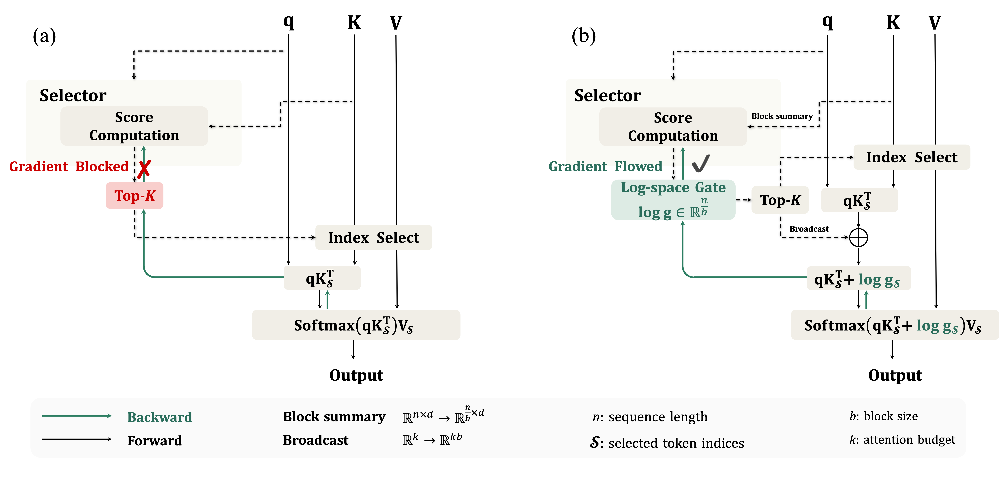

# SAS: Simple Attention Sparsification via End-to-End Optimization of Context Ranking

<p align="center">
  <a href="https://arxiv.org/abs/2609.13141"></a>
  <a href="https://github.com/Tencent-Hunyuan/Simple-Attention-Sparsification"></a>
  <a href="https://huggingface.co/tencent/Simple-Attention-Sparsification"></a>
</p>

**SAS** is a gated sparse-attention mechanism that learns, per query, which blocks to attend to — optimizing the context ranking **end-to-end**
with the language modeling loss instead of distilling the original model's dense
attention. 



***(a) Gradient blockage in discrete selection.** Standard sparse
attention relies on discrete Top-$K$ selection, which prevents gradients from
the language-modeling loss from reaching the selector. Consequently, existing
methods typically train the selector through auxiliary distillation objectives
or hand-designed heuristics rather than optimizing context ranking directly.*

***(b) Differentiable continuous gating.** SAS preserves discrete
Top-$K$ selection for efficient sparse computation, but equips each selected
block with a continuous soft gate. By incorporating these gates into the
attention logits, SAS establishes a differentiable path from the
language-modeling loss to the selector, enabling end-to-end optimization of
context ranking.*

## Setup
### Install via pixi

Get [pixi](https://pixi.sh) if you don't have it, then install the env + submodules:

```bash
curl -fsSL https://pixi.sh/install.sh | bash          # install pixi (skip if already present)
pixi install && git submodule update --init --recursive
```

## Training

SAS currently provides training recipes for the
[Qwen3-4B](https://huggingface.co/Qwen/Qwen3-4B),
[Qwen3-8B](https://huggingface.co/Qwen/Qwen3-8B), and
[Qwen3-14B](https://huggingface.co/Qwen/Qwen3-14B) models. Download the desired
base model and the
[OpenR1-Math-220k](https://huggingface.co/datasets/open-r1/OpenR1-Math-220k)
training dataset before launching.

Then select the script matching the model size:

```bash
export MODEL_PATH=/path/to/Qwen3-4B
export DATA_PATH=/path/to/OpenR1-Math-220k/data
bash scripts/train/simple_sparse_attention_Qwen3-4B.sh
```

> **Resource requirements.** SAS has relatively low resource requirements and
> can be trained on 8 NVIDIA H20 GPUs. We open-source the complete training and
> evaluation pipeline, including training recipes, evaluation scripts, and the
> SGLang-based sparse attention backend, to facilitate reproducibility.

## Evaluation

Eval serves the model through the sglang-blocksparse, so build its env once first:

```bash
cd third_party/sglang-blocksparse && pixi install && cd -
```

> **Note.** `sglang-blocksparse` is our [SGLang](https://github.com/sgl-project/sglang)
> fork, published at [rayleizhu/sglang](https://github.com/rayleizhu/sglang) and fetched
> via the submodule above. Training does not need it; only the eval scripts do. If you
> already have a checkout elsewhere, point the scripts at it with
> `SGLANG_DIR=/path/to/sglang-blocksparse`.

Each script starts a sglang server once, runs the benchmark, and tears it down.
Point `GATES` at an exported `AttnGates` dir (or `MODE=dense_4b BASE_MODEL=...` for
the dense baseline); `BUDGET` is the seer decode token budget; `TP=1 DP=8` gives 8
full replicas.

### 1. Reasoning Task - MATH, GPQA-Diamond, AIME24/25

```bash
export GATES=/path/to/AttnGates    # or: export MODE=dense_4b BASE_MODEL=/path/to/Qwen3-4B
export BUDGET=2048
export TP=1 DP=8
export TASK=math,gpqa,aime24,aime25
bash scripts/eval/run_reasoning.sh
```

### 2. Long Context Understanding Task - LongBench-E

```bash
export GATES=/path/to/AttnGates    # or: export MODE=dense_4b BASE_MODEL=/path/to/Qwen3-4B
export BUDGET=2048
export TP=1 DP=8
bash scripts/eval/run_longbench.sh
```

### 3. Agentic Task - BFCL, VitaBench

Function-calling ([BFCL](https://github.com/ShishirPatil/gorilla)) and multi-domain
tool-use ([VitaBench](https://github.com/meituan-longcat/vitabench)). These are large
upstream benchmarks kept as submodules under `third_party/` and run in their **own
venvs**; SAS only starts the sglang server and drives their CLIs.

One-time setup (per benchmark): init the submodule, build its venv, apply our patch
(the patch registers the qwen3 models / adjusts the client — kept as a file, not
vendored source):

```bash
git submodule update --init third_party/gorilla third_party/vitabench

# BFCL: own venv (.venv) inside the submodule
# (soundfile is a missing transitive dep of qwen_agent — install it explicitly)
BFCL=third_party/gorilla/berkeley-function-call-leaderboard
python -m venv $BFCL/.venv && $BFCL/.venv/bin/pip install -e $BFCL soundfile
git -C third_party/gorilla apply "$PWD/scripts/eval/patches/bfcl.patch"

# VitaBench: own venv (.venv) inside the submodule
python -m venv third_party/vitabench/.venv && third_party/vitabench/.venv/bin/pip install -e third_party/vitabench
git -C third_party/vitabench apply "$PWD/scripts/eval/patches/vitabench.patch"
```

The run scripts auto-activate these venvs (override with `BFCL_VENV` / `VITA_VENV`).

**BFCL** (function-calling):

```bash
export GATES=/path/to/AttnGates    # or: export MODE=dense_4b BASE_MODEL=/path/to/Qwen3-4B
export BUDGET=2048
export TP=1 DP=8
export CATEGORIES=multi_turn
bash scripts/eval/run_bfcl.sh
```

**VitaBench** (multi-domain tool-use) 
+ This benchmark additionally needs a cloud user-simulator and evaluator (we use DeepSeek-V4-Pro for both), so export `DEEPSEEK_API_KEY`:

```bash
export GATES=/path/to/AttnGates    # or: export MODE=dense_14b BASE_MODEL=/path/to/Qwen3-14B
export BUDGET=2048
export TP=1 DP=8
export DEEPSEEK_API_KEY=sk-...
export DOMAIN=delivery,instore,ota
bash scripts/eval/run_vitabench.sh
```

## Citation

If you find SAS useful in your research, please cite our paper.

```bibtex
@misc{li2026sassimpleattentionsparsification,
  title         = {SAS: Simple Attention Sparsification via End-to-End Optimization of Context Ranking},
  author        = {Zhiwei Li and Lei Zhu and Hao Gu and Xiang Hu and Yan Wang and Haitao Mi and Sirui Han and Leo Liang and Zhijiang Guo},
  year          = {2026},
  eprint        = {2609.13141},
  archivePrefix = {arXiv},
  primaryClass  = {cs.CL},
  url           = {https://arxiv.org/abs/2609.13141}
}
```

## Acknowledgements

- [SeerAttention-R](https://github.com/microsoft/SeerAttention) — gate architecture, and grading logic.
- [VeOmni](https://github.com/ByteDance-Seed/VeOmni) — training backbone.
- [sglang-blocksparse](https://github.com/rayleizhu/sglang) — our [SGLang](https://github.com/sgl-project/sglang) fork providing the `seer_attn` block-sparse backend used for eval.
- [BFCL / Gorilla](https://github.com/ShishirPatil/gorilla) and [VitaBench](https://github.com/meituan-longcat/vitabench) — function-calling / agent tool-use benchmarks.
